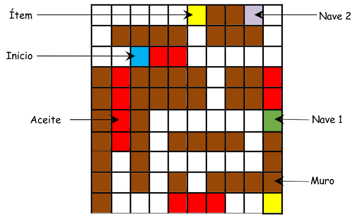

# Smart_Robot_IA

The smart robot is an agent whose objective is to find 2 items that are
hidden in a maze of 10x10 squares. In the environment, there are 2 ships
that the robot can use, that facilitate the exploration of the place.
But there is also a hostile element for the agent, there are places with
oil that affect the state of the robot.

# To execute

`python3 src/main.py`

# Examples
